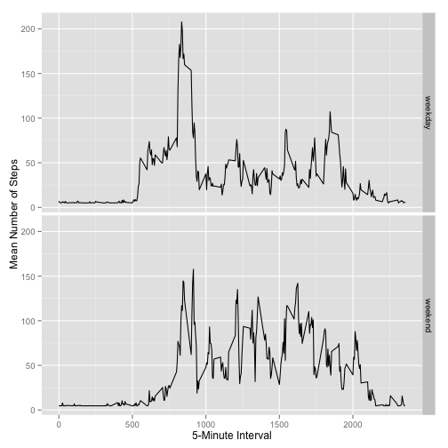

# Reproducible Research Assignment 1 #

## Analysis of Personal Activity Monitoring Patterns ##

### Load and Pre-Process Data ###

The dataset contains 17568 observations on three variables:
- steps: number of steps taken in a 5-minute interval (missing values are coded as NA)
- date: date measurement was taken
- interval: five-minute interval

Summary information regarding the dataset and individual variables are shown below. Note there are many missing values for the steps variable.


```r
activity <- read.csv("activity.csv")
str(activity)
```

```
## 'data.frame':	17568 obs. of  3 variables:
##  $ steps   : int  NA NA NA NA NA NA NA NA NA NA ...
##  $ date    : Factor w/ 61 levels "2012-10-01","2012-10-02",..: 1 1 1 1 1 1 1 1 1 1 ...
##  $ interval: int  0 5 10 15 20 25 30 35 40 45 ...
```

```r
summary(activity)
```

```
##      steps                date          interval     
##  Min.   :  0.00   2012-10-01:  288   Min.   :   0.0  
##  1st Qu.:  0.00   2012-10-02:  288   1st Qu.: 588.8  
##  Median :  0.00   2012-10-03:  288   Median :1177.5  
##  Mean   : 37.38   2012-10-04:  288   Mean   :1177.5  
##  3rd Qu.: 12.00   2012-10-05:  288   3rd Qu.:1766.2  
##  Max.   :806.00   2012-10-06:  288   Max.   :2355.0  
##  NA's   :2304     (Other)   :15840
```

### Mean Steps Per Day ###

A histogram shows the data are extremely right-skewed, with many zero values.


```r
hist(activity$steps)
```

 

```r
mean(activity$steps, na.rm=TRUE)
```

```
## [1] 37.3826
```

```r
median(activity$steps, na.rm=TRUE)
```

```
## [1] 0
```

That the median is zero confirms that at least half of the values are zero. That the mean is different from the median confirms that the data are skewed.


### Average Daily Activity Pattern ###

To determine the average daily activity pattern, we first must calculate the mean number of steps by 5-minute interval, then make a graph showing how the mean number of steps varies throughout the day. I used the "aggregate" function, which returns a data frame containing two variables: the 5-minute interval (called Group.1), and its mean number of steps (called x).


```r
avgsteps <- aggregate(x=activity$steps, by=list(activity$interval), FUN=mean, na.rm=TRUE)
plot(avgsteps$x ~ avgsteps$Group.1, type="l", xlab="5-Minute Interval", ylab="Mean Number of Steps", axes=FALSE)
axis(2, )
axis(1, seq(0, 2400, by=200))
```

 

The 5-minute time interval with the highest activity level is approximately 800.


### Imputing Missing Values ###


```r
ok <- complete.cases(activity)
msg <- sum(!ok)
```

The dataset has 2304 missing values. Since the proportion of missing values is so high, it can be prudent to impute the missing values. The code below creates a new dataset and fills in all missing values with the overall mean.


```r
act2 <- activity
act2$steps[is.na(act2$steps)] <- mean(act2$steps, na.rm=TRUE)
hist(act2$steps)
```

 

```r
mean(act2$steps)
```

```
## [1] 37.3826
```

```r
median(act2$steps)
```

```
## [1] 0
```

The histogram looks similar to the histogram of the original dataset, and the median and mean are identical to those of the original dataset.  This is to be expected because the imputed value was greater than zero (thus the median would be unchanged) and equal to the overall mean (so the mean would be unchanged).


### Differences in Activity Patterns: Weekdays vs. Weekends ###

To examine differences in activity on weekdays vs. weekends, first create a new variable called "weekend" that categorizes dates as either weekdays or weekend days.  Next, calculate the average activity level for each five-minute interval separately for weekdays and weekends, and then plot this data in a panel plot.

Based on the graph, it appears that overall activity is higher on weekends, but morning activity (between 5am and 10am) is higher on weekdays.


```r
act2$date2 <- as.Date(as.character(act2$date, format = "%Y-%m-%d"))
act2$dow <- weekdays(act2$date2)
act2$weekend <- "weekday"
act2$weekend[act2$dow == "Saturday"] <- "weekend"
act2$weekend[act2$dow == "Sunday"] <- "weekend"
act2$weekend <- as.factor(act2$weekend)
avgstep2 <- aggregate(x=act2$steps, by=list(act2$weekend, act2$interval), FUN=mean)
library(ggplot2)
ggplot(avgstep2, aes(x=Group.2, y=x)) + geom_line() + facet_grid(Group.1 ~ .) + xlab("5-Minute Interval") + ylab("Mean Number of Steps")
```

 


